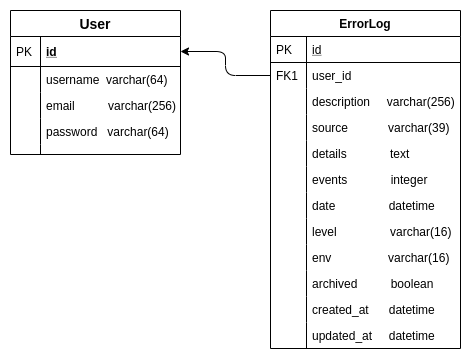

# Central de Erros

Sistema para centralizar registros de erros de aplicações. Projeto prático final da aceleração Python da codenation.

## Sobre o Projeto
Em projetos modernos é cada vez mais comum o uso de arquiteturas baseadas em serviços ou microsserviços. Nestes ambientes complexos, erros podem surgir em diferentes camadas da aplicação (backend, frontend, mobile, desktop) e mesmo em serviços distintos. Desta forma, é muito importante que os desenvolvedores possam centralizar todos os registros de erros em um local, de onde podem monitorar e tomar decisões mais acertadas. Neste projeto vamos implementar um sistema para centralizar registros de erros de aplicações.

## Backend - API
- criar endpoints para serem usados pelo frontend da aplicação
- criar um endpoint que será usado para gravar os logs de erro em um banco de dados relacional
- a API deve ser segura, permitindo acesso apenas com um token de autenticação válido

## Solução

### Tech
* [Django](https://www.djangoproject.com/)
* [Django REST Framework](https://www.django-rest-framework.org/)
* [REST Framework JWT Auth](https://jpadilla.github.io/django-rest-framework-jwt/)
* [Heroku](https://www.heroku.com/)
* [Insomnia](https://insomnia.rest/)


### Data Model



### API Endpoints

#### API de Logs
| Method | Endpoint | Descição |
| ------ | ------ | ------ |
| GET | v1/api/logs/?env={env}&ordering={ordering}&field={field}&search={search} | Realiza listagem de logs |
| POST | v1/api/logs/ | Realiza cadastro de novo log |
| GET | v1/api/logs/:id | Recupera um log existente por id |
| DELETE | v1/api/logs/:id | Exclui de um log existente por id |
| PATCH | v1/api/logs/:id | Arquiva de um log existente por id |

#### Atenticação
| Method | Endpoint | Descição |
| ------ | ------ | ------ |
| POST | auth/login/ | Realiza o login e retorna JWT |
| POST | auth/register/ | Registra um novo usuário |

## Como desenvolver?
1. Clone o repositório.
2. Crie um virtualenv com Python3.8
3. Ative o virtualenv.
4. Instale as dependências.
5. Configura a instância com o .env
6. Execute os testes

```console
git clone git@github.com:MarioGN/aceleradev-python-central-de-erros.git aceleradev-central-erros
cd aceleradev-central-erros
python -m venv .central
source .central/bin/activate
pip install -r requirements.txt
cp contrib/env-sample .env
python manage.py test
```


## Como fazer o deploy?
1. Crie uma instância no heroku.
2. Envie as configurações para o heroku.
3. Defina uma SECRET_KEY segura para a instância.
4. Defina DEBUG=False
5. Defina ALLOWED_HOSTS=.herokuapp.com
6. Envie o código para o heroku.

```console
heroku create minhainstancia
heroku git:remote -a minhainstancia
heroku config:set SECRET_KEY='python contrib/secret_gen.py'
heroku config:set DEBUG=False
heroku config:set ALLOWED_HOSTS=.herokuapp.com
git push heroku master --force
```